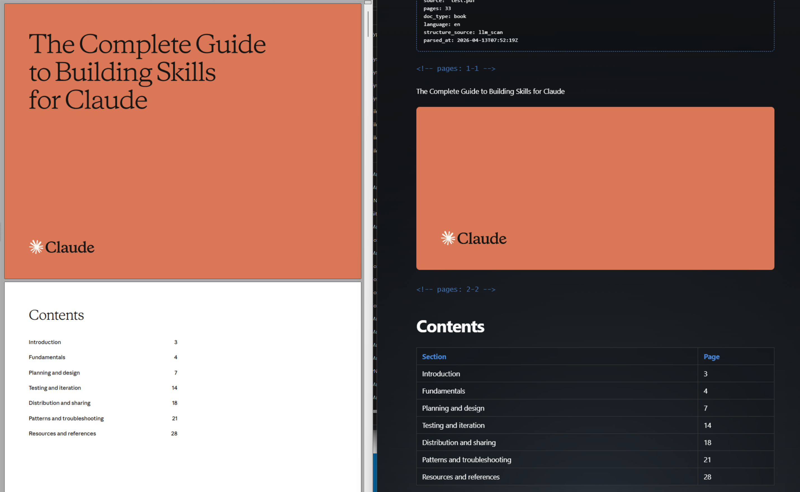
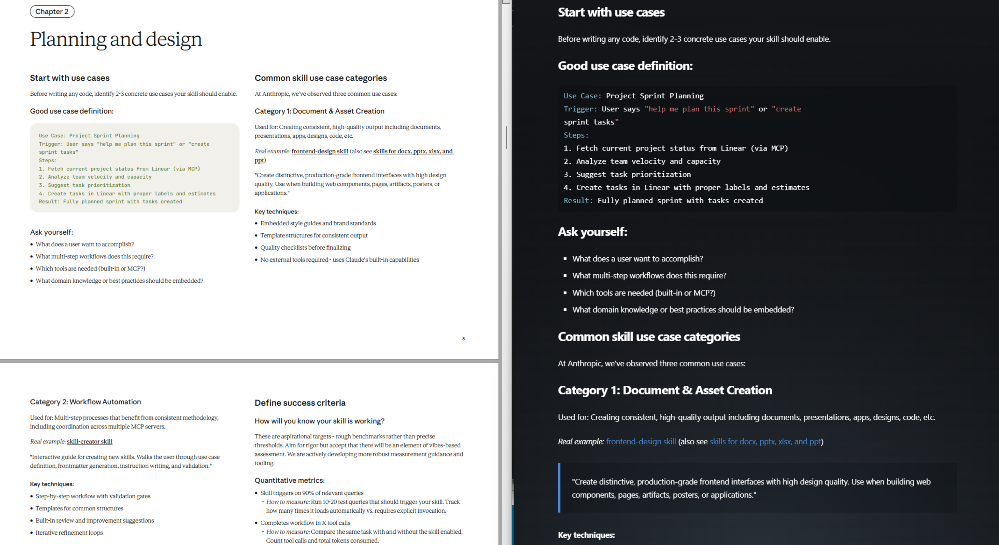
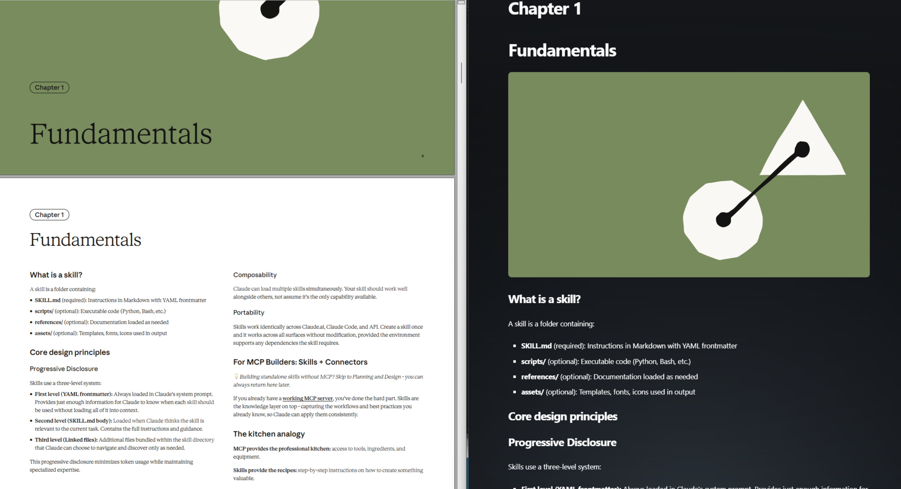
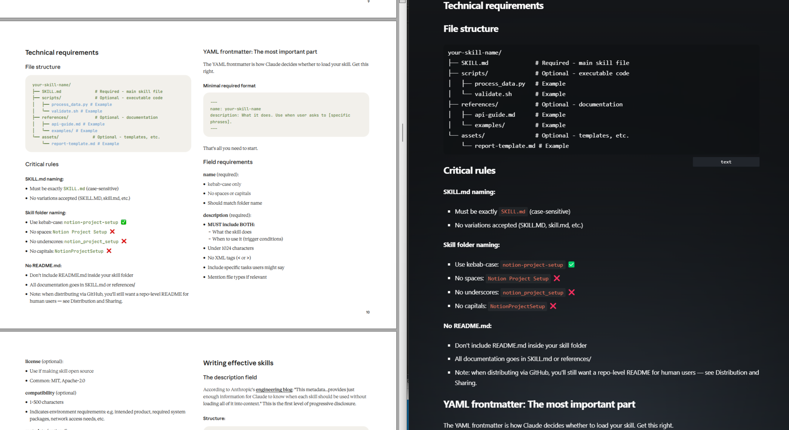
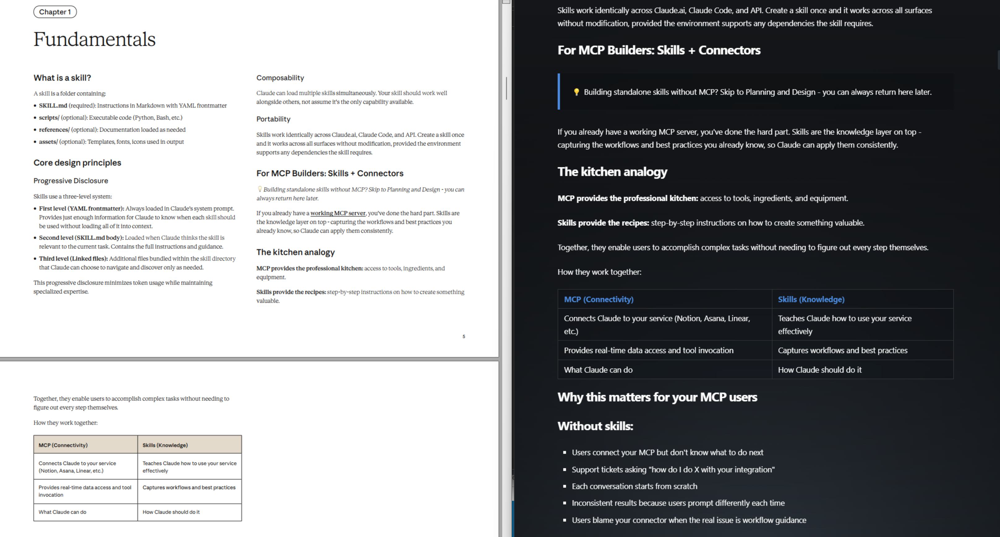
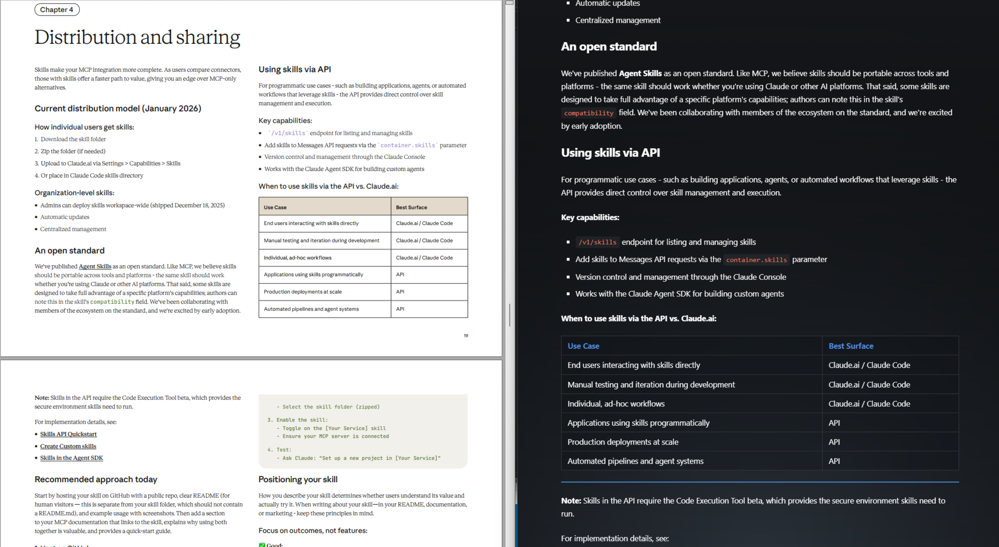
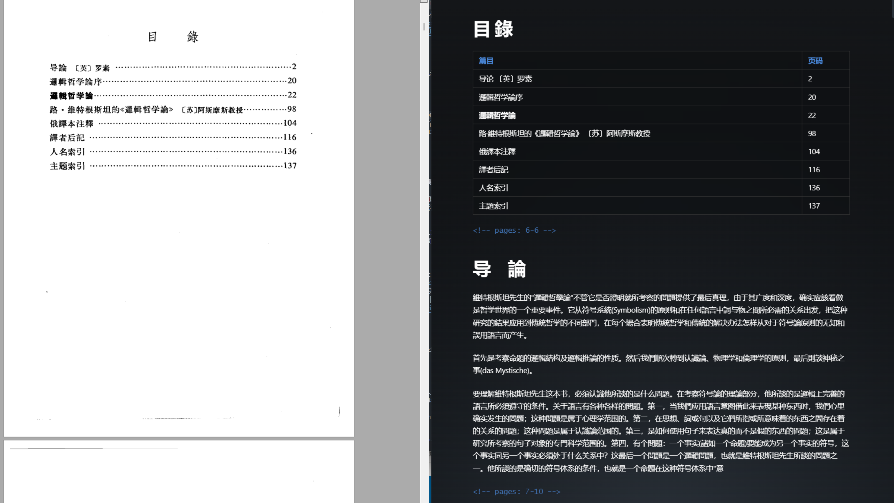
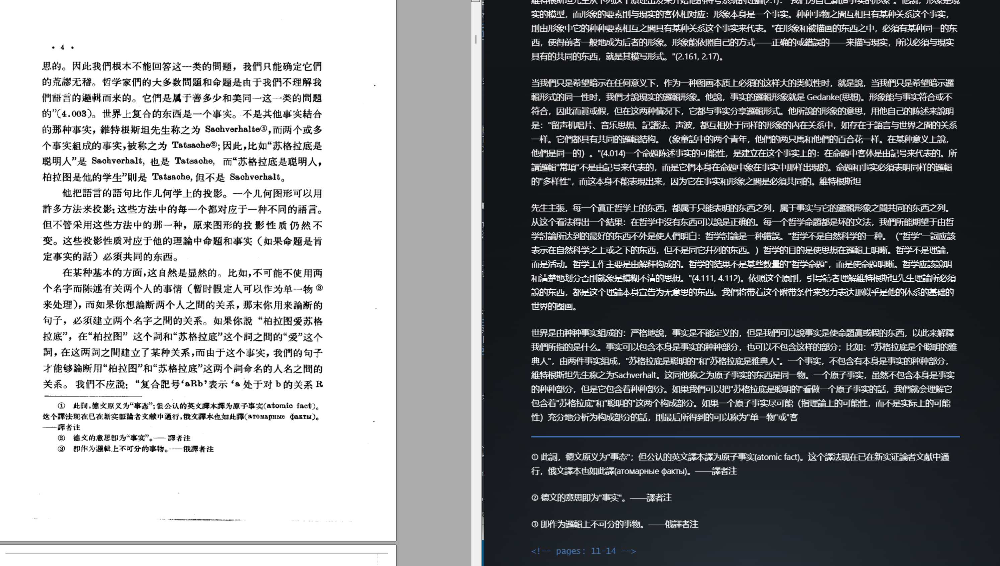
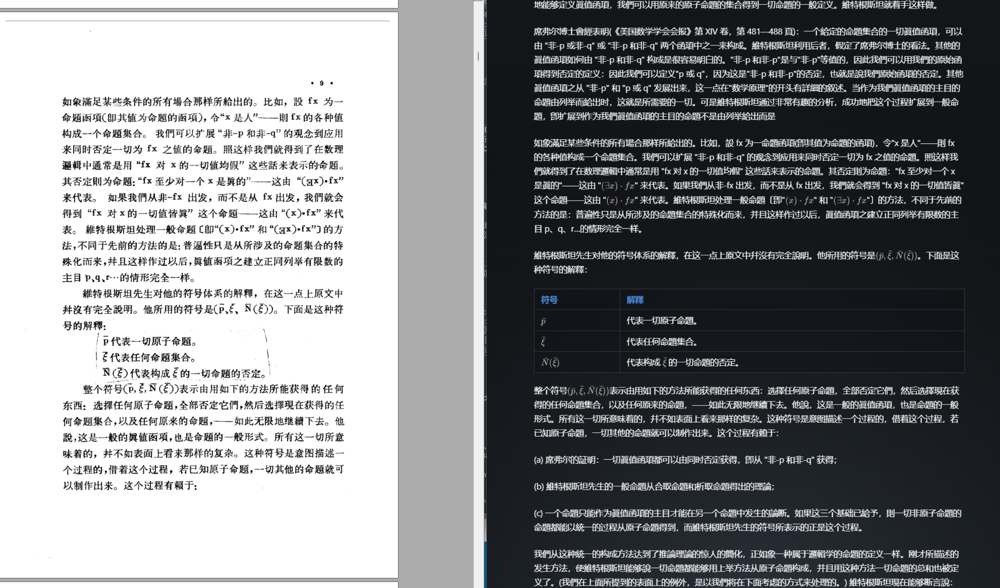
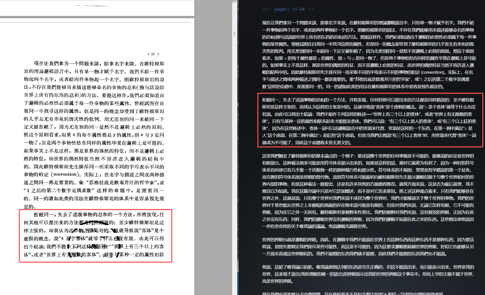

# pdfmark-ai

<p align="center">
  <strong>基于 LLM 视觉模型的 PDF 转 Markdown 工具。</strong>
</p>

<p align="center">
  丢入 PDF，得到干净的 Markdown — 表格、公式、代码、图表，全部搞定。
</p>

<p align="center">
  
  
  
  
</p>

<p align="center">
  <a href="#demo">效果演示</a> ·
  <a href="#installation">安装</a> ·
  <a href="#quick-start">快速开始</a> ·
  <a href="#configuration">配置说明</a> ·
  <a href="#cli-reference">命令行参考</a>
</p>

<p align="center">
  <a href="README.md">English</a> | 简体中文
</p>

pdfmark-ai 不使用传统方式解析 PDF。它将每一页渲染为图片，让多模态大模型（Claude、Kimi、Qwen 等）像人一样"阅读"页面。结果是什么？干净、结构化的 Markdown，能够处理其他工具搞不定的内容：复杂合并单元格的表格、行内数学公式、源代码块、嵌入的图表，甚至是模糊扫描件。

## Demo

学术论文和技术文档的真实转换效果 — 无任何后期编辑。

### 图片提取、表格与代码

<table>
  <tr>
    <td></td>
    <td></td>
  </tr>
  <tr>
    <td align="center"><em>PDF 原文 — 图片、表格与代码混合</em></td>
    <td align="center"><em>转换后的 Markdown — 图片已提取，表格已格式化</em></td>
  </tr>
</table>

<table>
  <tr>
    <td></td>
    <td></td>
  </tr>
  <tr>
    <td align="center"><em>PDF 原文 — 表格与代码块</em></td>
    <td align="center"><em>转换后的 Markdown — 语法高亮代码</em></td>
  </tr>
</table>

<table>
  <tr>
    <td></td>
    <td></td>
  </tr>
  <tr>
    <td align="center"><em>PDF 原文 — 图表与公式</em></td>
    <td align="center"><em>转换后的 Markdown — 图表已引用</em></td>
  </tr>
</table>

### 数学公式与模糊内容

<table>
  <tr>
    <td></td>
    <td></td>
  </tr>
  <tr>
    <td align="center"><em>PDF 原文 — 密集的数学公式</em></td>
    <td align="center"><em>转换后的 Markdown — LaTeX `$...$` 和 `$$...$$` 包裹</em></td>
  </tr>
</table>

<table>
  <tr>
    <td></td>
    <td></td>
  </tr>
  <tr>
    <td align="center"><em>PDF 原文 — 模糊/低质量扫描</em></td>
    <td align="center"><em>转换后的 Markdown — 内容被正确识别</em></td>
  </tr>
</table>

## 特性

- 🖼️ **基于视觉的提取** — 将每页视为图片，处理传统解析器无法应对的复杂排版
- 🧮 **数学公式** — 自动用 `$...$` 和 `$$...$$` 包裹 LaTeX
- 📊 **复杂表格** — 合并单元格、多行表头、嵌套结构
- 💻 **代码块** — 适合语法的源代码格式化
- ✂️ **图片提取** — `--crop-images` 将图表裁剪为独立文件
- 🔍 **模糊容忍** — 高准确率识别低质量和模糊扫描件
- 🤖 **多模型支持** — Claude、Kimi、小米、通义千问及任何 OpenAI 兼容 API
- ⚡ **增量缓存** — 基于 SHA-256 的渐进式缓存，避免重复处理

## 安装

```bash
pip install pdfmark-ai
```

## 环境要求

- Python >= 3.10
- 一个 LLM API Key（Anthropic、Kimi、Qwen 或 OpenAI 兼容的均可）

## 快速开始

```bash
# 第一步：在当前目录生成配置文件模板
pdfmark --init

# 第二步：编辑 .env — 取消注释一个提供商并填入你的 API Key
#   例如 LLM_API_KEY=your-kimi-api-key

# 第三步：运行
pdfmark input.pdf -o output.md
```

默认提供商为 **Kimi**（`kimi-for-coding`）。如需切换其他提供商，可以在 `.env` 中设置 `LLM_MODEL` / `LLM_BASE_URL`，或在 `pdfmark.toml` 中修改 `active_provider`。

> 💡 **提示：** 配置文件（`.env` 和 `pdfmark.toml`）始终从**当前工作目录**读取 — 而不是从包安装目录。将它们放在 PDF 文件旁边或项目根目录即可。

## 配置说明

pdfmark-ai 使用 4 层优先级链：**命令行参数 > 环境变量 > TOML 配置 > 默认值**。

配置文件放在你的**工作目录**（运行 `pdfmark` 的位置）：

| 文件 | 用途 | 包含内容 |
|------|------|----------|
| `.env` | API 密钥与覆盖 | `LLM_API_KEY`、`LLM_MODEL`、`LLM_BASE_URL` |
| `pdfmark.toml` | 提供商预设与设置 | 提供商、DPI、分块、缓存 |

可以用 `pdfmark --init` 生成这两个文件，也可以手动创建。

### .env（API 密钥）

```bash
# 取消注释一个提供商并填入你的 Key：
LLM_API_KEY=your-kimi-api-key
# LLM_API_KEY=your-anthropic-api-key
# LLM_API_KEY=your-qwen-api-key

# 可选：覆盖模型或基础 URL
# LLM_MODEL=claude-sonnet-4-20250514
# LLM_BASE_URL=https://api.your-provider.com/v1
```

### pdfmark.toml（设置）

```toml
active_provider = "anthropic"

[providers.anthropic]
base_url = "https://api.anthropic.com"
model = "claude-sonnet-4-20250514"

[render]
dpi = 150

[cache]
enabled = true
dir = "~/.cache/pdfmark"
```

### 支持的提供商

| 提供商 | `active_provider` | 备注 |
|--------|-------------------|------|
| Anthropic Claude | `anthropic` | 支持 Opus 4.6、Sonnet 4.6 及其他 Claude 模型。使用原生 Anthropic Messages API。 |
| Kimi（月之暗面） | `kimi` | Anthropic 兼容 API |
| 小米（MiMo） | `xiaomi` | 需要认证 Token |
| 通义千问（阿里） | `qwen` | OpenAI 兼容 SDK |
| 任何 OpenAI 兼容服务 | 设置 `LLM_BASE_URL` | 需设置 `LLM_SDK_TYPE=openai` |

## 命令行参考

```
用法: pdfmark [OPTIONS] [INPUT]

参数:
  INPUT                   要转换的 PDF 文件路径

选项:
  --init                  生成 .env 和 pdfmark.toml 配置模板
  -f, --force             覆盖已有配置文件（与 --init 配合使用）
  -o, --output            输出 Markdown 文件路径
  --lang                  文档语言（如 'en'、'zh'、'auto'）
  --crop-images           从页面中提取视觉区域为图片
  --refine                运行可选的 LLM 全局优化
  --no-cache              禁用页面和分块的缓存
  --no-frontmatter        省略输出中的 YAML 前言
  --detect-only           检测文档结构并打印章节，然后退出
  --config                TOML 配置文件路径
  --dpi                   PDF 页面渲染 DPI
  --model                 LLM 模型标识符
  --api-key               LLM API Key（或设置 LLM_API_KEY 环境变量）
  --base-url              LLM API 基础 URL
  --max-concurrent        最大并发 LLM 请求数
```

## 图片提取

使用 `--crop-images` 将 PDF 中的图表和示意图提取为独立的图片文件：

```bash
pdfmark input.pdf -o output.md --crop-images
```

裁剪的图片保存在输出文件旁边（如 `images/page_003_fig_001.png`）。裁剪模式和普通模式使用独立的缓存，可以自由切换，无需 `--no-cache`。

## 许可证

MIT
